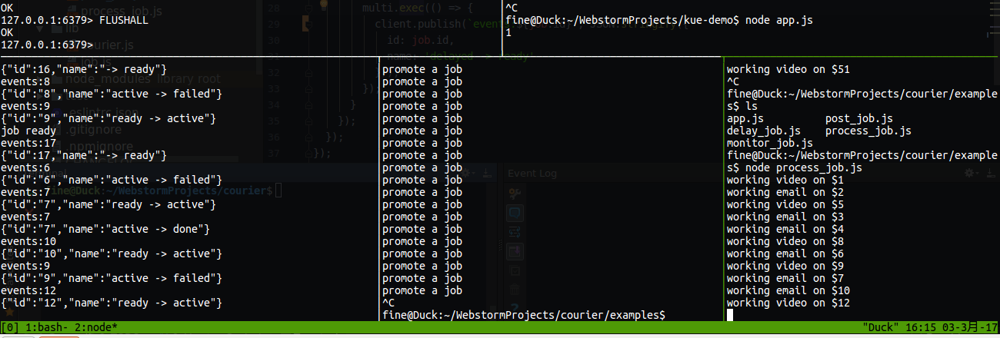
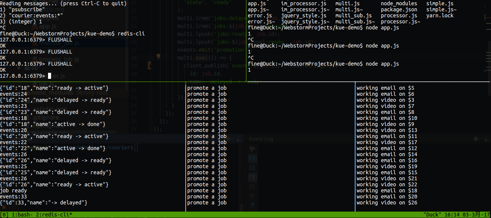

## 说明
运行方式：
- 测试正常发布分别运行（顺序无关），post_job.js、process_job.js
- 测试延迟发布分别运行（顺序无关），delay_job.js、process_job.js

## 实现功能 
- [x] 发布工作者能跟踪工作状态，及时处理工作
- [x] 及时处理队列中的消息
- [x] 保证 FIFO 的处理（延迟工作的执行没有保证）
- [x] 实现延迟工作
- [ ] 设置ttl，重启或移除超时工作
- [ ] 可以设置阈值，定期处理可能死掉的工作
- [ ] 成功的工作可以获取工作结果
- [x] 失败的工作可以获取失败原因
- [x] 对发布的工作的监听（完成、失败或者其他状态）
- [ ] 保存以及显示工作的进度情况
- [ ] 完善的错误处理逻辑

## 关于使用的锁
项目里用的是一个早一点的实现，叫 warlock，redis 的作者大大后来提出一个更安全的方式，对应也有一个 node 的实现，
叫 redlock

## 数据库设计
默认前缀为 courier，推荐改成 c，可以短一些

- courier:id 存储递增保存的工作号
- courier:jobs:\<type\>:\<state\> 工作队列，队列中存储的是工作号

其中，\<type\> 是用户指定的类型，而 \<state\> 是系统设计的几种状态，分别为

- ready 就绪状态，等待被处理
- active 激活状态，正在处理
- done 完成状态，处理完成且成功
- failed 失败状态，处理失败
- delayed 延迟状态，等待后续加入到就绪队列中

为了便于查询所有工作的状态，还有不按类型划分的工作队列
（这里存在潜在问题，即用户使用了和我们表达状态同名的工作类型，需要在系统中处理）

- courier:jobs:\<state\> 工作队列，队列中存储的是工作号

- courier:job:\<id\> 工作信息
    - id: 工作号
    - data: 工作数据
    - createdAt: 创建时间，默认为创建时时间，类型为时间戳数据
    - failedAt: 失败时间，默认为0，类型为时间戳数据
    - updatedAt: 更新时间，默认为创建时间，类型为时间戳数据
    - promotedAt: 开始处理时间，默认为0，类型为时间戳数据（考虑改成进入就绪工作时间，而开始处理时间由 startedAt 表示）
    - progress: 进度数据，默认为0，类型为从 0 - 100 的整数
    - error: 描述错误发生的字符串，默认为空（考虑去掉）
    - attempts: 1 失败尝试次数
    - maxAttempts: 1 最多允许失败尝试次数
    - delay: 默认为0，标示延迟多少毫秒执行
    - priority: -10 任务优先级，未实现
    - type: 任务类型
    - state: 任务状态，字符串表达

## 订阅发布事件设计
基于 redis 的订阅发布，我们可以实现工作的跟踪记录。也就是说，可以发布工作的对象可以在工作结束、工作失败等情况下
收到相应的通知。使用的频道：

- courier:events:\<job\> 其中 job 是工作号

其中的事件内容为字符串，因此我们将下列的结构转换成 JSON 字符串

- id: 工作号
- name: 事件名称
- data: 附带的数据（可为空）

事件包括：
- -> ready 进入就绪队列
- -> delayed 进入延迟工作队列
- ready -> active 进入当前工作队列
- active -> done 工作完成
- active -> failed 工作失败

## 已知缺陷
- 同一个消费者，如果选择处理多种工作，同一个时间内也只能处理一个工作（虽然用户总是可以给不同的工作起不一定数量的消费者）
- 为了完成失败重试、清理超时任务，需要轮询机制，kue 中轮询是放在任何一个消费者或者生产者身上，这种做法需要引入锁的机制，
我这里也打算这么做。虽然实践中，我觉得更好的是单独使用 pm2 等程序保证单个 node 进程负责轮询，用来完成这项任务。（用 pm2
这样的程序是为了保证这个负责轮询的 node 节点挂掉自动重启）
- 错误处理还是很糊涂

## pre alpha 阶段工作
### 正常发布工作

### 延迟发布工作

